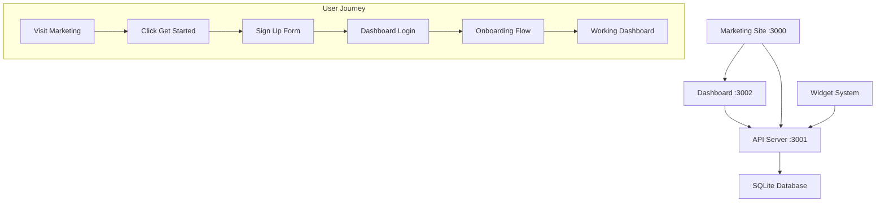

# Marketing to Dashboard Integration Design

## Overview

This design document outlines the technical architecture for seamlessly connecting the StorySlip marketing website to the dashboard application, creating a complete user journey from marketing site visitor to active product user.

## Architecture

### System Components



### Service Communication

1. **Marketing Site (Next.js :3000)**
   - Serves the beautiful marketing website
   - Contains signup/login links that redirect to dashboard
   - Handles pricing plan selection and passes to dashboard

2. **Dashboard (React :3002)**
   - Authentication pages (login, register, forgot password)
   - Main application interface
   - Protected routes with authentication checks
   - API integration for all functionality

3. **API Server (Node.js :3001)**
   - RESTful API endpoints
   - Authentication and session management
   - Database operations
   - Widget rendering and delivery

4. **Database (SQLite)**
   - User accounts and authentication
   - Content, widgets, and application data
   - Sample data for new users

## Components and Interfaces

### Authentication Flow

```typescript
interface AuthenticationFlow {
  // Marketing site redirects
  marketingToSignup: (plan?: string) => string;
  marketingToLogin: () => string;
  
  // Dashboard authentication
  signup: (userData: SignupData) => Promise<AuthResponse>;
  login: (credentials: LoginData) => Promise<AuthResponse>;
  logout: () => Promise<void>;
  
  // Session management
  validateSession: () => Promise<User | null>;
  refreshToken: () => Promise<string>;
}

interface SignupData {
  email: string;
  password: string;
  firstName: string;
  lastName: string;
  selectedPlan?: 'starter' | 'professional' | 'enterprise';
}

interface AuthResponse {
  success: boolean;
  user?: User;
  token?: string;
  error?: string;
}
```

### URL Configuration

```typescript
interface URLConfig {
  marketing: {
    base: 'http://localhost:3000';
    signup: 'http://localhost:3002/register';
    login: 'http://localhost:3002/login';
    signupWithPlan: (plan: string) => string;
  };
  
  dashboard: {
    base: 'http://localhost:3002';
    login: '/login';
    register: '/register';
    dashboard: '/dashboard';
    onboarding: '/onboarding';
  };
  
  api: {
    base: 'http://localhost:3001';
    auth: '/api/auth';
    users: '/api/users';
    content: '/api/content';
    widgets: '/api/widgets';
  };
}
```

### Database Integration

```sql
-- Core authentication tables
CREATE TABLE users (
  id INTEGER PRIMARY KEY AUTOINCREMENT,
  email VARCHAR(255) UNIQUE NOT NULL,
  password_hash VARCHAR(255) NOT NULL,
  first_name VARCHAR(100),
  last_name VARCHAR(100),
  selected_plan VARCHAR(50),
  created_at DATETIME DEFAULT CURRENT_TIMESTAMP,
  updated_at DATETIME DEFAULT CURRENT_TIMESTAMP
);

-- Session management
CREATE TABLE user_sessions (
  id INTEGER PRIMARY KEY AUTOINCREMENT,
  user_id INTEGER REFERENCES users(id),
  session_token VARCHAR(255) UNIQUE NOT NULL,
  expires_at DATETIME NOT NULL,
  created_at DATETIME DEFAULT CURRENT_TIMESTAMP
);

-- Sample data for new users
CREATE TABLE sample_content (
  id INTEGER PRIMARY KEY AUTOINCREMENT,
  user_id INTEGER REFERENCES users(id),
  title VARCHAR(255),
  content TEXT,
  type VARCHAR(50),
  created_at DATETIME DEFAULT CURRENT_TIMESTAMP
);
```

## Data Models

### User Model

```typescript
interface User {
  id: number;
  email: string;
  firstName: string;
  lastName: string;
  selectedPlan?: string;
  createdAt: Date;
  updatedAt: Date;
  
  // Relationships
  content?: Content[];
  widgets?: Widget[];
  organizations?: Organization[];
}
```

### Session Model

```typescript
interface UserSession {
  id: number;
  userId: number;
  sessionToken: string;
  expiresAt: Date;
  createdAt: Date;
}
```

### Sample Data Model

```typescript
interface SampleData {
  content: Array<{
    title: string;
    content: string;
    type: 'blog' | 'page' | 'widget';
  }>;
  
  widgets: Array<{
    name: string;
    type: 'gallery' | 'form' | 'carousel';
    config: Record<string, any>;
  }>;
  
  analytics: {
    views: number;
    conversions: number;
    performance: Record<string, number>;
  };
}
```

## Error Handling

### Authentication Errors

```typescript
enum AuthError {
  INVALID_CREDENTIALS = 'INVALID_CREDENTIALS',
  EMAIL_ALREADY_EXISTS = 'EMAIL_ALREADY_EXISTS',
  WEAK_PASSWORD = 'WEAK_PASSWORD',
  SESSION_EXPIRED = 'SESSION_EXPIRED',
  UNAUTHORIZED = 'UNAUTHORIZED'
}

interface ErrorResponse {
  success: false;
  error: AuthError;
  message: string;
  details?: Record<string, string>;
}
```

### API Error Handling

```typescript
interface APIErrorHandler {
  handleAuthError: (error: AuthError) => void;
  handleNetworkError: (error: NetworkError) => void;
  handleValidationError: (errors: ValidationError[]) => void;
  handleServerError: (error: ServerError) => void;
}
```

## Testing Strategy

### Integration Tests

1. **End-to-End User Journey**
   - Marketing site → Signup → Dashboard flow
   - Authentication and session management
   - Dashboard functionality with API integration

2. **API Integration Tests**
   - Authentication endpoints
   - CRUD operations for all resources
   - Error handling and validation

3. **Database Tests**
   - Migration execution
   - Sample data creation
   - Data integrity and relationships

### Component Tests

1. **Authentication Components**
   - Login form validation and submission
   - Registration form with plan selection
   - Protected route behavior

2. **Dashboard Components**
   - API data loading and display
   - User interactions and state management
   - Error boundary behavior

### Performance Tests

1. **Load Testing**
   - Concurrent user signups
   - Dashboard performance with sample data
   - API response times under load

2. **Database Performance**
   - Query optimization
   - Migration performance
   - Sample data generation speed

## Implementation Plan

### Phase 1: Core Authentication
- Set up authentication API endpoints
- Create login/register pages in dashboard
- Implement session management
- Connect marketing site links to dashboard

### Phase 2: Database Integration
- Run all existing migrations
- Create sample data generation system
- Implement user onboarding flow
- Test complete signup → dashboard journey

### Phase 3: Full Feature Integration
- Ensure all dashboard features work with API
- Implement error handling and user feedback
- Add loading states and offline handling
- Performance optimization

### Phase 4: Production Readiness
- Security hardening
- Comprehensive testing
- Documentation and setup scripts
- Deployment preparation

## Security Considerations

### Authentication Security
- Password hashing with bcrypt
- Secure session token generation
- HTTPS enforcement in production
- CSRF protection

### API Security
- JWT token validation
- Rate limiting on auth endpoints
- Input validation and sanitization
- SQL injection prevention

### Frontend Security
- XSS protection
- Secure cookie handling
- Content Security Policy
- Protected route implementation

## Deployment Configuration

### Environment Variables

```bash
# Marketing Site
NEXT_PUBLIC_DASHBOARD_URL=http://localhost:3002
NEXT_PUBLIC_API_URL=http://localhost:3001

# Dashboard
REACT_APP_API_URL=http://localhost:3001
REACT_APP_MARKETING_URL=http://localhost:3000

# API Server
PORT=3001
DATABASE_URL=sqlite:./storyslip.db
JWT_SECRET=your-jwt-secret-here
SESSION_SECRET=your-session-secret-here
CORS_ORIGINS=http://localhost:3000,http://localhost:3002
```

### Service Startup Order

1. Database setup and migrations
2. API server startup
3. Dashboard application startup
4. Marketing site startup
5. Health checks and verification

This design ensures a seamless user experience from marketing site to working product, with robust error handling, security, and performance considerations.